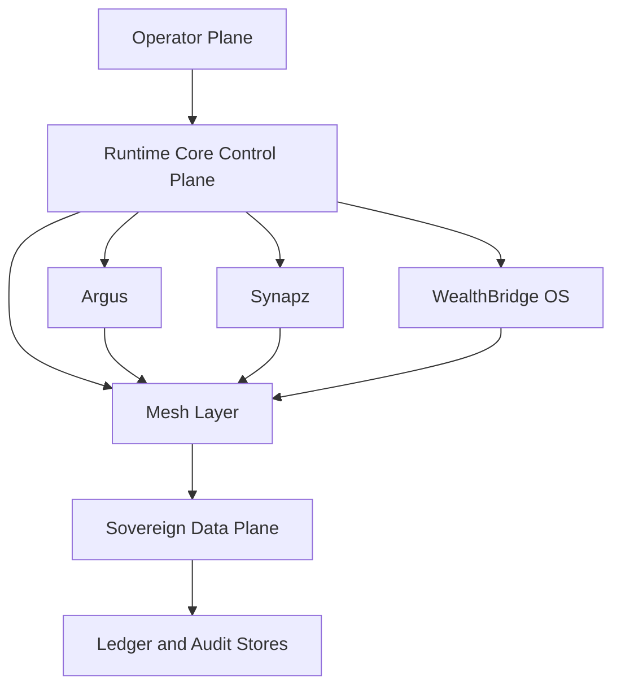

# Sovereign Launch Architecture

## Purpose
This architecture defines how Runtime Core launches sovereign operations across Argus, WealthBridge OS, Synapz, and Mesh Layer without relying on script-only orchestration.

## Design Goals
- Enforce sovereign control boundaries at workspace level.
- Keep financial and tax data traceable end-to-end.
- Allow fast mobility of workloads across workspace domains.
- Maintain operational resilience under partial failures.

## Logical Architecture

## Layer Model
1. Operator Plane
   - Human approval, governance decisions, and release authorization.
2. Control Plane
   - Runtime state, policy distribution, tenancy control, and health checks.
3. Execution Plane
   - Argus, WealthBridge OS, and Synapz workloads.
4. Mesh Layer
   - Service discovery, identity federation, replication routing, and locality policy.
5. Data and Audit Plane
   - Immutable events, ledger postings, and audit trace retention.

## Domain Responsibilities
- Argus
  - Continuously scores threat posture and emits trust-state updates.
  - Blocks or rate-limits unsafe cross-domain actions via policy hooks.
- WealthBridge OS
  - Runs accounting, tax automation, and settlement workflows.
  - Publishes tax-impacting events and filing checkpoints.
- Synapz
  - Executes agent workflows and capsule mobility plans.
  - Coordinates task continuity during failover or workspace handoff.
- Mesh Layer
  - Enforces identity-aware routing and secure service contracts.
  - Replicates state according to residency and sovereignty policy.

## Launch Sequence
1. Establish control-plane quorum and policy baseline.
2. Initialize Mesh identity and service discovery endpoints.
3. Register Argus and verify attestation stream.
4. Register Synapz and verify lifecycle event stream.
5. Register WealthBridge OS and verify tax and settlement streams.
6. Enable cross-domain workflow routes under policy checks.
7. Start continuous audit collection and SLO monitoring.

## Reliability and Recovery
- Each domain publishes heartbeat and readiness contracts.
- Mesh Layer isolates failed segments while preserving healthy routes.
- Argus can force policy downgrade mode for high-risk periods.
- Synapz replays workflow checkpoints after workspace relocation.
- WealthBridge OS resumes filings from last signed ledger checkpoint.

## Security and Compliance
- Mutual attestation required for all cross-workspace calls.
- Tax and financial events are append-only with replay support.
- Mobility operations must include source, destination, actor, and policy hash.

## Acceptance Criteria
- Control plane remains available with one domain outage.
- End-to-end trace exists for every tax-impacting action.
- Workspace migration completes with no orphaned workflow state.
- Incident containment decision propagates to all domains in bounded time.
